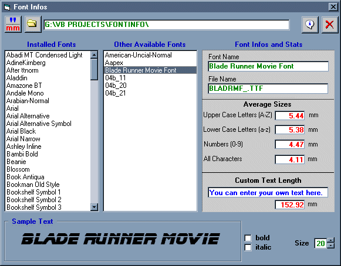



## Display Installed and Uninstalled Fonts samples and infos

### Description

This little piece of code will display all fonts (installed or not on your system) available on your computer, with some usefull statistics. Fully commented code for beginners/intermediates
 
### More Info
 
use easy API code

             |
---                |---
**Submitted On**   |2001-12-20 22:24:04
**By**             |[HarvestR](https://github.com/Planet-Source-Code/PSCIndex/blob/master/ByAuthor/harvestr.md)
**Level**          |Beginner
**User Rating**    |4.8 (24 globes from 5 users)
**Compatibility**  |VB 6\.0
**Category**       |[Complete Applications](https://github.com/Planet-Source-Code/PSCIndex/blob/master/ByCategory/complete-applications__1-27.md)
**World**          |[Visual Basic](https://github.com/Planet-Source-Code/PSCIndex/blob/master/ByWorld/visual-basic.md)
**Archive File**   |[Display In231707202001\.zip](https://github.com/Planet-Source-Code/harvestr-display-installed-and-uninstalled-fonts-samples-and-infos__1-25268/archive/master.zip)

### API Declarations

see in source code

